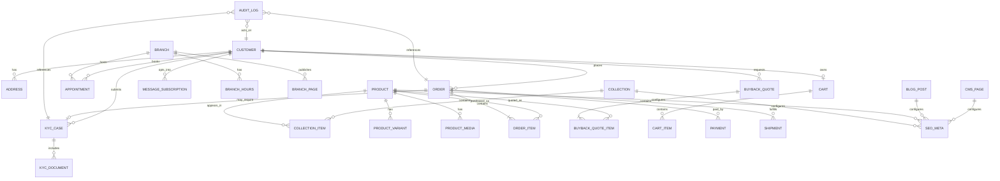
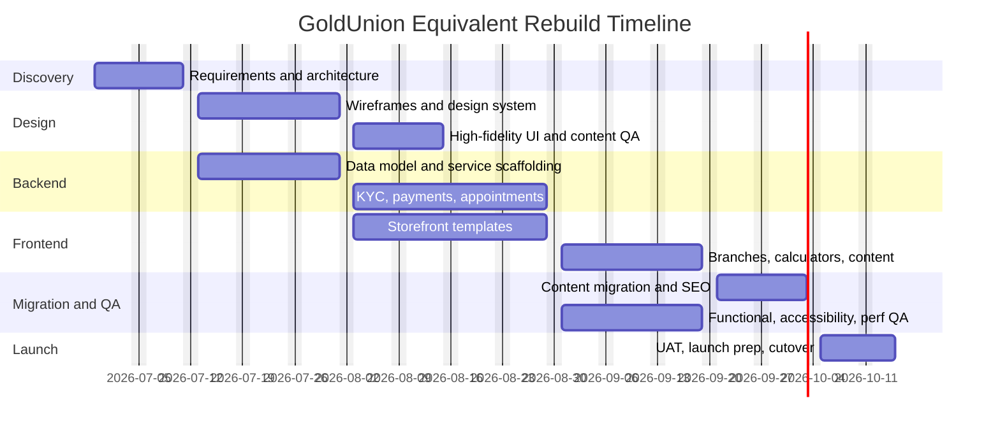

# GoldUnion Site Analysis and Rebuild PRD

## Executive summary

GoldUnion’s U.S. site is a Shopify-based precious-metals storefront with a mixed commerce-and-lead-generation model. The rendered site exposes a large public footprint through its own HTML sitemap: **331 public URLs** observed across **48 product pages, 25 collection URLs, 3 blog indexes, 137 articles, and 118 pages**, including **96 branch-detail pages** and multiple utility/legal pages. The core user journeys are: browse products, evaluate live gold/silver content, estimate sell-side value, book in-branch or at-home appointments, and complete a checkout flow that requires identity verification before order completion. The site also includes a branch locator, WhatsApp notification flows, account/cart affordances, and a hiring form. citeturn4view0turn4view1turn4view2turn10view6turn13view0

The platform stack is strongly identifiable as Shopify. The public `goldunion-us.myshopify.com` storefront redirects to `gold-union.com`; product pages expose Shopify-style variant JSON in the HTML; media is served from Shopify/CDN domains; and the account route resolves to Shopify customer-account flows. The rendered pages also show third-party integrations for **Stockist** store locator, **ReelUp** shoppable-video/tracking widgets, **Wax** WhatsApp notifications, and direct **WhatsApp** links, while the legal notice names **OVH** as host and **CosaVostra** as developer. citeturn13view3turn18view0turn19view0turn10view6turn25view0turn11view0

Functionally, the site is richer than a simple bullion catalog. It combines storefront commerce, content marketing, branch discovery, buyback education, redemption/estimate calculators, appointment booking, career lead capture, and legal/compliance messaging. However, it also shows notable quality and governance issues: duplicated appointment pages, publicly exposed junk or staging-style collections, inconsistent logistics and legal copy, U.S. pages that still reference French/EU wording, and several content/SEO hygiene problems. Those gaps are significant enough that a functionally equivalent rebuild should **preserve the successful journeys** but **not clone the information architecture literally**. citeturn25view2turn25view9turn23view3turn23view4turn24view2turn24view5turn24view8turn24view9turn12view0turn12view1turn26view4

The recommended rebuild path is a **Shopify-native or Shopify-headless implementation** with a normalized information architecture, first-class SEO, stronger compliance controls, and a dedicated backend layer for appointments, KYC, buyback quotes, audit trails, and operational workflows. For fastest parity and lowest risk, a custom Shopify theme or Hydrogen/Remix stack is the best fit; for more custom operational logic, a hybrid approach with app services or a separate backend API is preferable. Shopify’s own Ajax API supports common storefront patterns such as product JSON, cart operations, and recommendations without explicit customer auth, which aligns closely with the behaviors visible on the live site. citeturn28search1turn28search4turn28search7turn28search18

## Observed site architecture and crawl

### Crawl scope and high-level sitemap

The site’s own HTML sitemap is the most authoritative crawlable source visible from the public frontend. It shows these top-level content buckets: **Products**, **Collections**, **Blogs**, **Articles**, and **Pages**. The products list is extensive, the articles archive is large, and the pages section contains both transactional utilities and a very large branch-detail footprint. That structure is characteristic of a Shopify store that uses products and collections for commerce, pages for evergreen marketing and utility content, and blogs/articles for SEO content publishing. citeturn4view0turn4view1turn4view2

| Public content family | Observed count | Notes on hierarchy and purpose |
|---|---:|---|
| Home | 1 | Main landing page combining commerce, branch discovery, appointment booking, FAQs, testimonials, and sell-side promos |
| Products | 48 | Product detail pages for bullion, coins, bars, and some accessories or utility products |
| Collections | 25 | Shop/category/category-like landing pages, including valid merch collections and several cleanup candidates |
| Blog indexes | 3 | `news`, `gold-buying-guide`, `silver-buying-guide` families observed in sitemap/article structures |
| Articles | 137 | SEO/editorial archive, especially under `/blogs/news` and `/blogs/silver-buying-guide` |
| Pages | 118 | Static/utility pages, calculators, charts, legal content, branch directory, appointments, branch details, and other landing pages |
| Branch detail pages | 96 of pages | Local landers following a `buy-sell-gold-{city}` pattern |
| Total observed public URLs | 331 | Derived from the HTML sitemap’s public link inventory |

The live site also surfaces routes and utilities not obvious from navigation alone, such as `/account`, cart interactions, and shipping-related flows. The customer account route appears to be Shopify-native; the cart is visible site-wide as a dynamic drawer/mini-cart; and checkout messaging references shipping calculation and post-order identity verification. citeturn13view0turn10view7turn11view0

### Verified public URL inventory

The following URLs were directly verified during research as public and live.

| Template family | Directly verified URLs | Purpose |
|---|---|---|
| Core pages | `/`, `/pages/contact`, `/pages/branches`, `/pages/faq`, `/pages/guide`, `/pages/legal-notice`, `/pages/general-terms-and-conditions`, `/pages/return-delivery-policy`, `/pages/join-us`, `/pages/make-an-appointment`, `/pages/book-an-appointment`, `/pages/order-lookup-1`, `/pages/our-history`, `/pages/sell-gold`, `/pages/estimate-your-gold`, `/pages/sale-objects`, `/pages/gold-chart`, `/pages/silver-chart`, `/pages/silver-price`, `/pages/terms-of-use` | Marketing, utility, legal, appointments, calculators, charts, careers, branch discovery |
| Branch examples | `/pages/buy-sell-gold-santa-clarita`, `/pages/buy-sell-gold-costa-mesa`, `/pages/buy-sell-gold-malibu`, `/pages/buy-sell-gold-bakersfield`, `/pages/buy-sell-gold-san-diego` | Branch-detail template proof and URL pattern validation |
| Products | `/products/10-dollars-gold-eagle`, `/products/20-dollars-gold-double-eagle`, `/products/1-gram-gold-bar`, `/products/1-kilo-silver-bar`, `/products/1-kilo-cast-bar`, `/products/oz-american-gold-eagle-coin`, `/products/1-oz-american-silver-eagle`, `/products/1-oz-gold-bar`, `/products/1-oz-gold-buffalo`, `/products/1-oz-silver-buffalo`, `/products/1-10-oz-american-gold-eagle-coin`, `/products/1-2-oz-american-gold-eagle-coin`, `/products/1-4-oz-american-gold-eagle-coin`, `/products/10-gram-gold-bar`, `/products/10-oz-gold-bar`, `/products/10-oz-silver-bar`, `/products/100-oz-silver-bar`, `/products/2-5-gram-gold-bar`, `/products/20-gram-gold-bar`, `/products/5-gram-gold-bar`, `/products/50-gram-gold-bar`, `/products/50-gram-cast-bar`, `/products/500-gram-cast-bar`, `/products/australia-1-oz-gold-emu`, `/products/australia-1-oz-gold-kangaroo`, `/products/australia-1-oz-silver-kangaroo`, `/products/austria-1-oz-gold-philharmonic-coin`, `/products/austria-1-oz-silver-philharmonics`, `/products/austria-1-2-oz-gold-philharmonic`, `/products/austria-gold-4-ducat`, `/products/canada-1-oz-gold-maple-leaf`, `/products/canada-1-oz-silver-maple-leaf`, `/products/canada-1-2-oz-gold-maple-leaf`, `/products/china-1-oz-gold-panda`, `/products/china-15-gram-gold-panda`, `/products/china-30-gram-silver-panda`, `/products/great-britain-1-oz-gold-britannia`, `/products/great-britain-1-oz-silver-britannia`, `/products/great-britain-1-2-oz-gold-britannia`, `/products/sovereign`, `/products/mexico-gold-50-pesos`, `/products/parts-pliers`, `/products/saint-lucia-1-ounce-gold-coin`, `/products/south-africa-1-oz-silver-krugerrand`, `/products/south-african-1-oz-gold-krugerrand`, `/products/creadit-cart-3`, `/products/creadit-cart-2`, `/products/goldunion-box` | Commerce catalog |
| Collections | `/collections/accessories`, `/collections/american-gold-eagle-coins`, `/collections/bars-1`, `/collections/black-friday`, `/collections/buy-gold-1`, `/collections/buy-gold`, `/collections/buy-gold-bars`, `/collections/buy-gold-coins`, `/collections/buy-silver`, `/collections/buy-silver-bars`, `/collections/buy-silver-coins`, `/collections/coins`, `/collections/dummy-collection`, `/collections/pamp-gold-bars`, `/collections/pieces-or-investissement`, `/collections/reelup-do-not-delete-en-1`, `/collections/see-all-gold`, `/collections/see-all-silver`, `/collections/shop-en-1`, `/collections/uncategorized-en-1` | Category pages, seasonal landers, plus clearly exposed cleanup/staging collections |
| Blogs and articles | `/blogs/news`, `/blogs/news/the-monnaie-de-paris-an-institution-that-has-left-its-mark-on-history`, `/blogs/silver-buying-guide/everything-you-need-to-know-about-silver`, `/blogs/silver-buying-guide/everything-you-need-to-know-about-925-sterling-silver-1`, `/blogs/silver-buying-guide/how-to-invest-in-money-1` | Blog index and article sample verification |

This verified inventory is enough to confirm the site’s core route taxonomy and public URL conventions. The HTML sitemap shows many more branch-detail and article URLs than were practical to re-open one by one in this environment, but the route patterns are clear and repeatable from the verified examples and the sitemap itself. citeturn25view4turn25view0turn25view1turn25view2turn25view3turn25view5turn25view6turn25view7turn25view8turn25view9turn17view0turn41view0turn41view1turn41view2turn41view3turn18view0turn18view1turn18view2turn18view3turn18view4turn18view5turn18view6turn18view7turn18view8turn18view9turn19view0turn19view1turn19view2turn19view3turn19view4turn19view5turn19view6turn19view7turn19view8turn19view9turn20view0turn20view1turn20view2turn20view3turn20view4turn20view5turn20view6turn20view7turn20view8turn20view9turn21view0turn21view1turn21view2turn21view3turn21view4turn21view5turn21view6turn21view7turn21view8turn21view9turn22view0turn22view1turn22view2turn22view3turn22view4turn22view5turn22view6turn22view7turn23view0turn23view1turn23view2turn23view3turn23view4turn23view5turn23view6turn23view7turn23view8turn23view9turn24view0turn24view1turn24view2turn24view3turn24view4turn24view5turn24view6turn24view7turn24view8turn24view9turn42view0turn42view2turn42view3turn42view4

### Page hierarchy, purpose, UI components, and assets

| Template | Primary purpose | Key UI components | Required assets |
|---|---|---|---|
| Home | Brand landing, category discovery, branch discovery, appointment CTA, bestsellers, calculator, sell-side education | Ticker strip, mega-nav, hero, product cards, investment calculator, branch locator, appointment form, FAQ accordion, testimonials, trust/press strip, footer newsletter | Product imagery, trust badges, press logos, iconography, branch data, copy blocks |
| Collection | Product discovery and filtering | Breadcrumbs, result count, sort controls, filters by weight/price/category, product grid, FAQs, educational blocks | Product thumbnails, filter metadata, SEO copy, structured collection metadata |
| Product detail | Conversion page for bullion/accessories | Media gallery, price, quantity stepper, tiered pricing, specs, add-to-cart, contact callback CTA, description, cross-sell, testimonials, trust section | Product gallery, variant/price JSON, structured specs, review/testimonial content |
| Branch index | Find nearest location | Intro, store locator map, branch list, global trust blocks | Branch records with address/phone/geo, map integration |
| Branch detail | Local SEO + appointment booking + branch trust page | Local hero, address/hours/phone, booking form, explanatory copy, local directions, product recommendations | Branch-specific copy, hero image(s), geo metadata, branch hours, appointment slots |
| Appointment landing | Generic appointment capture | Two-form tabbed flow for in-branch and at-home service, branch selector, date/time slots, consent checkbox | Branch list, slot logic, validation messages, privacy link |
| Estimate-your-gold | Redemption pricing and self-service estimate | Pricing table by karat/material, valuation tool entry point, SEO copy, hallmarks guidance | Metal rates, material categories, hallmark guidance |
| Sale objects | Explain accepted and rejected sell-side items | Accepted/rejected image grid, estimate CTA, long-form SEO content | Object-category images, taxonomic labels |
| Gold/silver chart pages | Market education + lead generation | Chart section heading, explanatory content, FAQs, related links | Live chart integration, historical series, FAQ copy |
| Blog index | Content discovery | Topic/category list, article cards | Featured images, categories, publishing dates |
| Article | SEO/editorial | Hero/title/date, article body, inline images, share links, recent posts | Article body, images, metadata, author/date |
| Contact | Contact channels + appointment + store locator | Email blocks, phone, appointment forms, locator, newsletter | Contact emails, phone, forms, map data |
| Join us | Recruiting lead capture | Careers intro, file-upload form | Job form fields, CV upload, candidate-status backend |
| Legal/terms/policy | Compliance | Static rich text pages | CMS/legal text |

The homepage alone demonstrates the site’s hybrid nature. It combines a **hero**, **best-selling products**, an **investment calculator**, a **Stockist-powered branch locator**, a **two-mode appointment form** with validation, embedded FAQs, testimonials, and sell-side education. That same pattern of “transaction + education + lead capture” reappears throughout the site and should be considered a core product requirement, not decorative content. citeturn34view0turn34view1turn34view2turn34view3turn35view0turn35view1turn35view2

## Frontend functionality inventory

### Template-by-template functional inventory

| Template | UI and interaction inventory | Client-side validation and dynamic behavior | Accessibility and SEO requirements |
|---|---|---|---|
| Home | Mega-menu, cart drawer, search affordance, WhatsApp shortcut, hero CTAs, add-to-cart product cards, calculator, locator, appointment forms, FAQ expansion, testimonials | Live metal price strip, add-to-cart from cards, calculator filtering by metal/form/budget, async locator load, appointment slot selection, phone/date/time validation, consent gating | Semantic landmarks, keyboardable nav, accessible modal/cart, filter/form labels, FAQ heading structure, visible error states, canonical home metadata |
| Collection | Breadcrumbs, result count, sort dropdown, filter groups, product tiles, FAQs, educational content | Sort changes, filter refinement, grid/list display changes, add-to-cart from tile, possibly ajax refresh | Crawlable filters where needed, noindex for useless parameter states, collection schema/metadata, keyboardable filter drawers, focus management |
| Product | Gallery, possibly video/3D media, price block, quantity stepper, bulk discount table, specs, add-to-cart, callback CTA, related products, WhatsApp back-in-stock | Quantity stepper, sold-out state, variant JSON backing page state, cart add, WhatsApp waitlist modal, contact callback modal, recommendations | Product structured data, alt text for gallery, tab order, accessible dialogs, clear stock state, review snippet markup if real reviews are used |
| Branch index | Branch list, embedded locator, global trust content | Async map load; location search/refine inside locator | Location schema, map fallback text, accessible search field, strong local SEO internal linking |
| Branch detail | Local content, phone and address, appointment form, branch selector, directions text, product recommendations | Branch-specific slot validation, phone/date/time errors, consent, product-card interactions | LocalBusiness schema, address/phone/hours consistency, accessible forms and headings, canonicalization |
| Appointment landing | Two flow variants: in-branch and at-home | Branch selector; service-type toggle; date/time slot dependency; phone/date/time validation; privacy consent required | Form labels, inline errors, focus on first invalid field, accessible tab/segmented control |
| Estimate your gold | karat/material price table, “start estimate” CTA, redemption simulator, educational content | Estimate tool likely computes based on weight and type; depends on current metal rates | Calculator must be fully keyboard accessible; explanatory text for results; crawlable educational copy |
| Sale objects | Buy/do-not-buy tabs or section toggles, image taxonomy grid | Tab/anchor switching between accepted and rejected object types | Strong image alt text, descriptive headings, no duplicate H1/H2 misuse |
| Chart pages | Live-price content, chart area, FAQs, educational article body | Live or embedded chart refresh, possibly historical interval switches | Chart needs accessible data-table fallback; avoid image-only charts; structured FAQ + article metadata |
| Blog index/article | Article cards, categories, inline article images, share links, recent posts | Pagination/archive browsing, article sharing actions | Article structured data, unique meta titles, author/date consistency, image alt text |
| Join us | Basic applicant form with CV upload | Required-field checks, file-upload constraints | Accessible file upload, privacy disclosure, success/error messaging |
| Contact | Contact options, appointment forms, locator, newsletter | Form validation, store-locator load, newsletter submission | Clear labels and purpose, anti-spam, privacy consent if needed |
| Order lookup/account/cart | Account link, cart drawer, order lookup utility page | Session-based customer access and cart persistence | Secure session handling, protected route behavior, accessible drawer |

The collection pages show a fairly standard but complete merchandising toolkit: **result count, sort controls, facet filters for weight/price/category**, and product-grid interactions. The gold collection lists 33 products with sort options such as featured, bestsellers, alphabetical order, price order, and date order, plus filter buckets for weight, price, and category. The silver collection shows the same pattern. Those controls are the minimum baseline for a replacement storefront. citeturn15view0turn15view1

Product detail pages are richer than a bare Shopify PDP. They expose **tiered bulk pricing**, **quantity controls**, **detailed specifications**, **related products**, **customer testimonials**, and a **contact/callback CTA**. Some products are sold out and show alternative handling; others expose an **embedded variant JSON blob** with fields such as `id`, `sku`, `requires_shipping`, `taxable`, `available`, `price`, and `quantity_rule`. Several products also show a **WhatsApp notification flow** for stock events. citeturn18view0turn19view0turn20view0turn21view0turn25view0

Appointment capture is a first-class site capability. The home page, contact page, generic appointment pages, and branch-detail pages all expose booking forms with a **branch selector**, **sell/buy intent selector**, **name**, **phone**, **email**, **date**, **time slots**, and a required **privacy-policy acceptance checkbox**. The at-home version additionally requests an address and even exposes latitude/longitude fields in the rendered interface. Validation strings such as “Please enter valid phone number,” “Please enter Date,” and “Please select time” are visible in the DOM, so the replacement should preserve both client-side and server-side validation paths. citeturn13view2turn17view0turn26view0turn26view1turn35view0

The selling side has two distinct frontend experiences. The **“Estimate your Gold”** page contains a rate table by material/karat and a redemption simulator, while the **“Sale Objects”** page explains what the business buys and does not buy using a visual taxonomy grid of accepted and rejected items. Together, those pages imply the need for two service modules: a fast calculator and a deeper item-eligibility content hub. citeturn38search0turn40view0

### Accessibility and SEO requirements for the rebuild

The live site uses many dialogs, drawers, form flows, and embedded widgets. In the rebuild, modal and dialog interactions should follow the WAI-ARIA modal dialog pattern, including inert background behavior, focus trapping, logical initial focus, and full keyboard support. WCAG 2.2 AA should be the baseline across forms, dynamic content, media, and calculators. citeturn31search0turn31search1turn31search17

SEO should not merely replicate the existing pages; it should correct structural issues. Google’s official starter guidance emphasizes crawlability, descriptive titles, structured internal linking, and useful people-first content. Core Web Vitals should also be product requirements: field performance should hit “good” thresholds at the 75th percentile for LCP, INP, and CLS. citeturn31search2turn31search18turn31search3turn31search7turn31search15

Minimum rebuilt SEO/A11y acceptance criteria should therefore include: canonical URLs on all primary templates; noindex or redirect cleanup for junk/staging collections; structured data for product, FAQ, article, and local business pages; alt text and accessible chart fallbacks; fully labeled forms; keyboard support for nav, filters, and dialogs; and multilingual/schema hygiene if regionalization is added later. citeturn31search0turn31search2turn31search4turn31search21

## Platform, API, and backend requirements

### Observed network and integration signals

A full browser HAR export was not available in this environment, so the inventory below distinguishes **directly observed frontend signals** from **platform-inferred endpoints** supported by official documentation. That distinction matters: some integrations are explicit in rendered content, while Shopify APIs are strongly implied by the platform and page structure. 

| Type | Observation | Evidence | Rebuild implication |
|---|---|---|---|
| Commerce platform | Shopify storefront / myshopify redirect | `goldunion-us.myshopify.com` redirects to the public domain; account route attempts resolve through Shopify account flow | Keep Shopify-compatible data model and route behavior, or reproduce with a headless Shopify backend | 
| Product data | Variant JSON embedded in product page | Product pages expose JSON arrays with `id`, `sku`, `available`, `price`, `taxable`, `requires_shipping`, `quantity_rule` | PDP must be backed by structured variant/offer data |
| Media/CDN | Shopify CDN assets referenced | Product pages reference `cdn.shopify.com` assets; store pages serve assets from Shopify-style URLs | CDN-backed responsive media is required |
| Store locator | Stockist integration | Branch/contact/home pages explicitly say “Loading store locator from Stockist store locator” | Branch locator can be implemented via Stockist or replaced with Maps + custom search |
| Video / tracking | ReelUp present | “ReelUp tracking pixel” appears in rendered pages; a public `REELUP (DO NOT DELETE)` collection is exposed | Rebuild should decide whether to keep shoppable videos or remove unused public artifacts |
| WhatsApp automation | Wax integration | WhatsApp waitlist modal says “Powered by Wax”; pages expose “Notify me on WhatsApp” flows | Back-in-stock and engagement messaging need formal lifecycle/event support |
| Direct messaging | WhatsApp deep link | Header/footer expose `wa.me` link | Keep click-to-chat option |
| Hosting/provider disclosure | OVH and CosaVostra named in legal notice | Legal notice names OVH host and CosaVostra developer | New implementation can choose different infrastructure, but legal CMS must expose accurate vendor list |
| Account area | Shopify customer account route | Account redirects attempt to `/account` from Shopify customer pages | Customer auth/session exists and must be preserved |

These signals are directly visible across the live pages. citeturn13view0turn13view3turn18view0turn19view0turn10view6turn25view0turn23view0turn11view0

### Observed and inferred API inventory

Because the site is Shopify-backed, the most likely storefront API layer is Shopify’s Ajax API. Shopify documents the Ajax API as **unauthenticated**, **JSON-based**, and without hard rate limits, though still subject to Shopify abuse prevention. Official references also document product JSON endpoints and cart endpoints such as add/update/change. That aligns with the live site’s visible cart drawer behavior, product quantity controls, and embedded product JSON. citeturn28search1turn28search4turn28search7

| Endpoint / behavior | Status | Method | Auth | Notes |
|---|---|---|---|---|
| `/{locale}/products/{handle}.js` | Platform-inferred, strongly likely | GET | None | Official Shopify product JSON endpoint; fits observed product handles and embedded variant data |
| `/{locale}/cart.js` | Platform-inferred, strongly likely | GET | Session/cart cookie | Standard Shopify cart read endpoint for cart drawer/minicart |
| `/{locale}/cart/add.js` | Platform-inferred, strongly likely | POST | Session/cart cookie | Standard cart add action behind “Add to cart” buttons |
| `/{locale}/cart/change.js` | Platform-inferred, strongly likely | POST | Session/cart cookie | Standard quantity or line-change action |
| `/{locale}/cart/update.js` | Platform-inferred, strongly likely | POST | Session/cart cookie | Cart notes/attributes/bulk updates |
| Product recommendations endpoint | Platform-inferred, likely | GET | None | Shopify has a recommendations Ajax API; live PDPs show related products |
| Stockist embed/widget requests | Directly observed integration; internal endpoints not exposed | Mixed | N/A | Locator is rendered by Stockist embed code |
| Wax / WhatsApp widget requests | Directly observed integration; internal endpoints not exposed | Mixed | N/A | Modal waitlist and “Powered by Wax” imply client-side subscription/event calls |
| Account auth endpoints | Inferred via Shopify customer flow | Mixed | Customer session | `/account` exists, but exact auth API not exposed publicly in rendered text |

**Observed product JSON shape** from product pages includes fields like these:

```json
[
  {
    "id": 48703831933219,
    "title": "Default Title",
    "sku": "Canada 1 oz Gold Maple Leaf",
    "requires_shipping": true,
    "taxable": true,
    "available": true,
    "name": "Canada 1 oz Gold Maple Leaf",
    "price": 474300,
    "inventory_management": null,
    "quantity_rule": {
      "min": 1,
      "max": null,
      "increment": 1
    }
  }
]
```

That schema is directly visible in the product HTML and should be treated as a minimum payload requirement for the rebuild’s product service layer. citeturn21view0turn18view0turn19view0turn20view0

**Illustrative cURL examples** for a functionally equivalent Shopify-style implementation:

```bash
curl -X GET "https://example.com/products/canada-1-oz-gold-maple-leaf.js"
```

```bash
curl -X POST "https://example.com/cart/add.js" \
  -H "Content-Type: application/json" \
  -d '{
    "items": [
      {
        "id": 48703831933219,
        "quantity": 1
      }
    ]
  }'
```

```bash
curl -X GET "https://example.com/cart.js"
```

```bash
curl -X POST "https://example.com/cart/change.js" \
  -H "Content-Type: application/json" \
  -d '{
    "id": "line_item_key_or_variant_id",
    "quantity": 2
  }'
```

Those examples are not raw HAR captures from the live domain, but they are consistent with Shopify’s official Ajax API and the site’s observed architecture. citeturn28search0turn28search1turn28search4turn28search7

### Proposed backend services and data model

A rebuild should not rely exclusively on theme/template logic. GoldUnion’s functional scope warrants a service layer that cleanly separates storefront commerce from operational workflows.

| Domain service | Why it is needed | Core responsibilities |
|---|---|---|
| Catalog service | Commerce catalog is central and fairly large | Products, variants, collections, media, merchandising metadata |
| Pricing service | Prices change rapidly and calculator/quote pages depend on rates | Metal spot rates, premiums, pricing snapshots, bulk-discount tables |
| Cart/checkout orchestration | Required for equivalent storefront behavior | Cart persistence, shipping options, checkout handoff, tax and fee logic |
| Customer/account service | Account route exists; order history likely required | Profiles, addresses, customer sessions, order lookup |
| KYC/compliance service | Site requires ID verification before order completion and states 5-year retention | KYC case creation, document collection, review status, retention rules |
| Appointment service | Booking is a core conversion path | Branch calendars, slots, appointment lifecycle, reminders, CRM sync |
| Branch/location service | Site has 96 local pages plus locator | Branch metadata, hours, geo, local SEO content, locator search |
| Buyback quote service | Estimate and sell-side flows require modeling | Material types, karat tables, quote estimates, appraisal requests |
| Content/CMS service | Blog and legal pages are extensive | Articles, FAQs, legal text, marketing pages, revision history |
| Messaging service | WhatsApp and email flows are meaningful | Back-in-stock, reminders, abandoned cart, order updates, newsletter |
| Audit/ops service | Precious-metals and KYC flows are high accountability | Security logs, admin actions, compliance events, retention policies |

### Proposed relational schema



| Table | Key fields | Notes |
|---|---|---|
| `customer` | `id`, `email`, `first_name`, `last_name`, `phone`, `status`, `created_at` | Core user record |
| `address` | `id`, `customer_id`, `type`, `line1`, `line2`, `city`, `state`, `postal_code`, `country`, `lat`, `lng` | Customer and at-home-appointment addresses |
| `branch` | `id`, `slug`, `name`, `manager_name`, `phone`, `email`, `address_*`, `lat`, `lng`, `is_opening_soon`, `seo_city`, `published` | Supports locator and local pages |
| `branch_hours` | `id`, `branch_id`, `weekday`, `open_time`, `close_time`, `break_start`, `break_end` | Branch-specific slot logic |
| `branch_page` | `id`, `branch_id`, `hero_title`, `hero_copy`, `directions_copy`, `local_faq_json` | Local SEO layer |
| `product` | `id`, `sku_root`, `slug`, `title`, `description_html`, `metal_type`, `origin_country`, `mint`, `published` | Catalog root |
| `product_variant` | `id`, `product_id`, `shopify_variant_id`, `title`, `price_minor`, `currency`, `available`, `requires_shipping`, `taxable`, `weight_g`, `purity_ppm`, `barcode`, `inventory_policy` | Mirrors observed variant JSON and pricing |
| `product_media` | `id`, `product_id`, `type`, `url`, `alt_text`, `sort_order` | Image/video/3D assets |
| `collection` | `id`, `slug`, `title`, `description_html`, `is_indexable`, `is_public`, `sort_default` | Needed because current site exposes both valid and junk collections |
| `collection_item` | `collection_id`, `product_id`, `position` | Many-to-many merchandising |
| `cart` | `id`, `customer_id`, `session_token`, `currency`, `subtotal_minor`, `created_at`, `updated_at` | Guest and logged-in carts |
| `cart_item` | `id`, `cart_id`, `variant_id`, `qty`, `unit_price_minor`, `line_total_minor` | Cart lines |
| `order` | `id`, `customer_id`, `order_number`, `status`, `payment_status`, `fulfillment_status`, `currency`, `subtotal_minor`, `tax_minor`, `shipping_minor`, `total_minor`, `shipping_method`, `placed_at` | Commerce order |
| `order_item` | `id`, `order_id`, `variant_id`, `product_title`, `qty`, `unit_price_minor`, `line_total_minor` | Immutable line snapshot |
| `payment` | `id`, `order_id`, `provider`, `method_type`, `amount_minor`, `status`, `provider_ref`, `authorized_at`, `captured_at` | Card/bank transfer/check/cash support |
| `shipment` | `id`, `order_id`, `carrier`, `service_level`, `tracking_number`, `insured_value_minor`, `status`, `dispatched_at`, `delivered_at` | Insured delivery tracking |
| `kyc_case` | `id`, `customer_id`, `order_id`, `status`, `review_state`, `provider`, `started_at`, `verified_at`, `expiry_at` | Required because checkout completion requires identity verification |
| `kyc_document` | `id`, `kyc_case_id`, `doc_type`, `country`, `file_url`, `checksum`, `status`, `retention_until` | Document chain of custody |
| `appointment` | `id`, `customer_id`, `branch_id`, `mode`, `intent`, `date`, `start_time`, `end_time`, `address_id`, `notes`, `status`, `source_page` | In-branch vs at-home bookings |
| `buyback_quote` | `id`, `customer_id`, `status`, `estimated_total_minor`, `currency`, `requested_at` | “Estimate your gold” and follow-up buyback workflow |
| `buyback_quote_item` | `id`, `quote_id`, `material_type`, `karat`, `weight_g`, `est_rate_minor`, `est_total_minor` | Redemption simulator payload |
| `message_subscription` | `id`, `customer_id`, `channel`, `phone`, `email`, `topic`, `opt_in_source`, `consent_at`, `status` | WhatsApp/newsletter/back-in-stock |
| `cms_page` | `id`, `slug`, `title`, `body_html`, `page_type`, `published_at` | Static and legal pages |
| `blog_post` | `id`, `blog_slug`, `slug`, `title`, `excerpt`, `body_html`, `author`, `published_at` | Editorial layer |
| `seo_meta` | `id`, `object_type`, `object_id`, `meta_title`, `meta_description`, `canonical_url`, `robots`, `schema_json` | Centralized SEO control |
| `audit_log` | `id`, `actor_type`, `actor_id`, `event_type`, `object_type`, `object_id`, `ip`, `user_agent`, `created_at` | Security, compliance, admin and customer traceability |
| `price_snapshot` | `id`, `metal`, `currency`, `spot_minor`, `premium_minor`, `captured_at` | Supports “updated every minute” claims and calculators |

### OpenAPI outline for the rebuilt platform

```yaml
openapi: 3.1.0
info:
  title: GoldUnion Equivalent Platform API
  version: 1.0.0
paths:
  /catalog/products:
    get:
      summary: List products with filters/sort/pagination
  /catalog/products/{slug}:
    get:
      summary: Get product detail, media, price, availability, bulk tiers
  /catalog/collections/{slug}:
    get:
      summary: Get collection detail and paginated products
  /pricing/spot-rates:
    get:
      summary: Get current gold/silver/platinum rates
  /pricing/buyback-estimate:
    post:
      summary: Calculate estimated buyback value
  /cart:
    get:
      summary: Read current cart
  /cart/items:
    post:
      summary: Add line items
  /cart/items/{itemId}:
    patch:
      summary: Update quantity or properties
    delete:
      summary: Remove item
  /checkout/session:
    post:
      summary: Create checkout session / handoff
  /customers/register:
    post:
      summary: Register customer
  /customers/login:
    post:
      summary: Login customer
  /customers/me/orders:
    get:
      summary: List customer orders
  /orders/lookup:
    post:
      summary: Lookup order by number and email/token
  /kyc/cases:
    post:
      summary: Start KYC verification
  /kyc/cases/{id}:
    get:
      summary: Get KYC status
  /kyc/cases/{id}/documents:
    post:
      summary: Upload ID document
  /branches:
    get:
      summary: List/search branches
  /branches/{slug}:
    get:
      summary: Get branch detail and local SEO content
  /appointments:
    post:
      summary: Create appointment
  /appointments/{id}:
    get:
      summary: Read appointment status
  /content/pages/{slug}:
    get:
      summary: Get CMS page
  /content/blogs/{blogSlug}/posts:
    get:
      summary: List posts in blog
  /content/blogs/{blogSlug}/posts/{slug}:
    get:
      summary: Get article detail
  /marketing/subscriptions:
    post:
      summary: Subscribe to email or WhatsApp topics
```

## Security, compliance, legal, and product gaps

### Security and compliance requirements

The live site explicitly states that purchasing precious metals requires **valid identification** and that the information is retained for **five years**. The FAQ also says buyers must provide valid ID and references U.S. federal laws, including the **Bank Secrecy Act** and **USA PATRIOT Act**, while the site’s legal pages say purchases may be made by **bank transfer, credit card, check, or cash**. That means the rebuilt platform needs formal KYC capture, secure document retention, and payment-method-aware compliance logic from the outset. citeturn11view0turn16view1turn16view2

For U.S. operations, the rebuild should also support cash-reporting workflows. The IRS states that businesses generally must file **Form 8300** when they receive **more than $10,000 in cash** in one transaction or related transactions, and the IRS reference guide explains the timing and aggregation rules. This is especially relevant because the live legal notice says GoldUnion accepts cash. citeturn11view0turn29search2turn29search10turn29search13

PCI scope should be minimized aggressively. The PCI Security Standards Council states that merchants whose electronic cardholder-data functions are completely outsourced to validated third parties may fall into **SAQ A** scenarios, while redirect, embedded, and direct-post models can change scope. Since the live site appears to use a standard Shopify commerce stack and does not visibly expose custom card fields in the rendered content, the safest architectural requirement is: **keep card entry entirely on PCI-validated hosted payment pages or embedded provider pages that preserve the lowest possible merchant PCI scope**. citeturn29search0turn29search5turn29search8turn29search9

If the rebuilt site serves California users—as the current legal text suggests—it also needs privacy workflows aligned with the CCPA/CPRA framework: notice at collection, rights request handling, deletion/right-to-know workflows where applicable, and Global Privacy Control handling when the business falls into sale/share scenarios. The California Attorney General’s guidance summarizes consumer rights including the rights to know, delete, opt out of sale/sharing, and non-discrimination. citeturn11view0turn32search0turn32search10turn32search16

If the client later targets EU/EEA residents, GDPR obligations apply as well. The European Commission and EDPB explain that GDPR includes rights such as access, rectification, erasure, restriction, portability, objection, and protections against solely automated decisions. Since this site handles identity documents, appointment data, communications preferences, and potentially buying/selling financial-asset-adjacent information, GDPR-readiness should be a design choice even if launch is U.S.-only. citeturn30search1turn30search2turn30search5turn30search16

**Security requirements for the rebuild**

| Control area | Requirement |
|---|---|
| Identity | Customer auth via hardened hosted provider or Shopify accounts; admin SSO; MFA for staff |
| KYC | Vendor-backed or internal workflow with encrypted uploads, review states, retention clock, purge jobs |
| Payments | Hosted payment provider pages; no raw PAN on merchant servers; bank transfer/check instructions in controlled templates |
| Secrets and encryption | TLS everywhere; encryption at rest for PII and KYC docs; envelope encryption for document keys |
| Logging | Immutable audit logs for admin actions, KYC events, pricing updates, order state changes |
| Fraud/AML | Manual-review queues, sanctions/PEP screening option, suspicious-activity escalation policy, cash-reporting support |
| File handling | Malware scanning, MIME/type validation, size limits, signed URLs |
| Data governance | Retention schedule by data class, legal hold support, privacy-request workflows |
| Infrastructure | WAF/CDN, DDoS protection, rate limiting on forms and auth, bot protection on appointments and newsletter |
| SDLC | Dependency scanning, SAST/DAST, secrets scanning, least-privilege infra access |

### Functional, UX, performance, and SEO gaps

The most important gaps are not visual; they are structural.

| Priority | Gap | Why it matters | Evidence |
|---|---|---|---|
| P0 | Public junk/staging collections are indexable | Hurts brand trust, crawl budget, and IA clarity | `dummy-collection`, `REELUP (DO NOT DELETE)`, `shop-en-1`, `uncategorized-en-1`, `buy-gold-1`, redirecting `buy-gold-bars` openly resolve as public URLs |
| P0 | Duplicate appointment pages | Creates duplicate content and maintenance drift | `/pages/book-an-appointment` and `/pages/make-an-appointment` render the same booking flow |
| P0 | Legal/logistics contradictions | High risk for customer confusion and compliance issues | Shipping cost/time/cash/check rules differ across homepage, FAQ, legal notice, and delivery policy |
| P0 | Locale/regional copy leakage | Undermines credibility and legal accuracy | U.S. pages still reference goldunion.fr, French Consumer Code, Euro chart copy, “European states,” and French-language strings |
| P1 | Order lookup page appears functionally thin or broken | User expectation mismatch | Order Lookup page renders mostly title/footer with no visible utility form |
| P1 | Branch-detail content QA issues | Local SEO risk and user mistrust | Costa Mesa page includes copy referencing Fresno; multiple branch pages are “Coming soon” yet fully public |
| P1 | Content taxonomy is bloated | Harder navigation and weaker SEO | Too many overlapping collection names and duplicate shop categories |
| P1 | Accessibility risk across modals/forms | Many dialogs and forms mean high AA failure risk if not intentionally designed | Cart drawer, WhatsApp modal, appointment forms, dynamic locator, product media |
| P2 | Public social/link inconsistencies | Soft trust issue | “LinkedIn” icon points to Indeed France on multiple pages |
| P2 | Search/order/account utilities not clearly surfaced | Utility discoverability issue | Search exists as affordance but not as a clearly defined experience in observed content |

These are directly visible on the live site. For example, homepage FAQ copy says silver-bar sale price includes **20% VAT** and shipping via USPS is **$20**, while the FAQ page says standard shipping is **$25**, premium is **$35**, and the delivery policy/legal pages describe different shipment timelines and hold periods for checks. Likewise, legal text mentions the U.S. and California while still citing French-law concepts and even `goldunion.fr` in the terms. citeturn23view3turn23view4turn23view6turn24view2turn24view5turn24view8turn24view9turn25view2turn25view9turn35view0turn16view0turn16view1turn11view0turn12view0turn12view1turn26view4turn26view2turn41view0turn42view0

### Recommended improvements

| Priority | Recommendation | Outcome |
|---|---|---|
| P0 | Rebuild IA around a curated sitemap, not the current public URL sprawl | Prevents junk indexing and simplifies governance |
| P0 | Normalize legal/compliance content into a single source of truth | Eliminates contradictory shipping/payment/KYC statements |
| P0 | Make KYC a formal post-checkout/pre-fulfillment state machine | Reduces risk and operational confusion |
| P1 | Consolidate appointment flows into one reusable booking engine | Fewer duplicate pages, better analytics, easier QA |
| P1 | Build branch pages from structured branch/CMS data | Safer local SEO and less copy drift |
| P1 | Add robust local/business/product/article schema | Better discoverability and rich-result eligibility |
| P1 | Introduce performance budgets and script governance | Prevents widget bloat from carts, maps, videos, messaging |
| P1 | Replace hard-coded testimonial blocks with manageable CMS components | Easier governance and authenticity control |
| P2 | Add meaningful site search, order lookup, and account help UX | Better support deflection and conversion recovery |
| P2 | Introduce analytics and event taxonomy owned by the client | Reliable funnel, appointment, and KYC monitoring |

## Product requirements document

### Product vision and scope

**Vision:** Build a trustworthy, conversion-oriented precious-metals platform that lets customers buy certified gold/silver products, book branch or at-home appointments, estimate sell-side value, discover nearby branches, and manage orders and identity-verification requirements with high compliance confidence.

**Primary user types**

| Persona | Goals | High-value journeys |
|---|---|---|
| Retail buyer | Buy bullion/coins safely at transparent prices | Browse collection → PDP → cart → checkout → KYC → shipment |
| Seller / buyback customer | Estimate value and schedule appraisal/sale | Estimate tool → learn eligible items → book appointment → branch visit / at-home appraisal |
| Local branch prospect | Find nearest branch and trust it | Branch locator → local branch page → phone or appointment |
| Research/content visitor | Learn market basics and trust brand | Chart page / guide / article → collection or branch CTA |
| Returning customer | Access orders/account | Account → order status → reorder / support |
| Job applicant | Apply to open roles | Join Us form with CV upload |

**Goals**
- Preserve all revenue-driving storefront behavior.
- Preserve and improve local branch lead generation.
- Preserve buyback estimator and object taxonomy.
- Support KYC and compliant payments.
- Clean up IA, legal consistency, and SEO.
- Improve accessibility and operational maintainability.

**Non-goals**
- Reproducing French/legacy content inconsistencies.
- Publicly exposing staging/demo collections or unused app artifacts.
- Rebuilding every historical article by hand before MVP if content migration can be automated.

### Functional requirements

| Epic | Requirement | Acceptance criteria |
|---|---|---|
| Storefront catalog | Users can browse by collection, filter, sort, and open product pages | Collection pages support facets, sorting, pagination, canonical metadata |
| Product detail | Users can inspect specs, media, price tiers, availability, and add to cart | PDP renders media, specs, bulk tiers, quantity selection, cart action, recommendations |
| Cart and checkout | Users can manage a cart and start checkout | Cart persists per session/user, supports qty changes and removals, shows shipping/tax messaging |
| Payments | Support configurable payment methods: card, bank transfer, check, cash or pickup policies as configured | Payment options vary by order amount/region; provider-webhook state sync works |
| KYC | Orders that require identity verification create a KYC case before shipment/release | Case status visible to staff; blocked fulfillment until pass; docs encrypted and retained correctly |
| Appointments | Users can book in-branch or at-home appointments | Slot availability enforced, confirmations sent, branch calendars manageable |
| Branches | Users can find and view local branches | Locator search works, each branch has local SEO page and structured metadata |
| Buyback estimate | Users can estimate sell-side value by type/karat/weight | Estimate uses configurable rates and shows disclaimers |
| Sale-object taxonomy | Users can see what is and isn’t purchasable by GoldUnion | Accepted/rejected taxonomy is CMS-managed |
| Content | Editors can manage guides, FAQs, charts, legal pages, and blog posts | CMS publishing workflow exists with preview/versioning |
| Messaging | Users can opt into email and WhatsApp notifications | Consent stored; back-in-stock and appointment reminders can be triggered |
| Careers | Applicants can submit a form with CV upload | File validation, admin notifications, candidate record creation |
| Order lookup | Guest lookup and logged-in order history supported | Lookup form verifies by order number + email/phone/token; customer account shows order list |

### Non-functional requirements

| Area | Requirement |
|---|---|
| Performance | 75th percentile CWV in “good” range for LCP, INP, CLS on major templates |
| Accessibility | WCAG 2.2 AA for all critical flows |
| Reliability | 99.9% uptime target for storefront; graceful degradation for third-party widgets |
| Security | Hosted payments, encrypted PII/KYC, RBAC, audit logs, WAF |
| Scalability | Handle catalog growth, content growth, seasonal traffic, marketing campaigns |
| Observability | Centralized logs, error tracking, business events, funnel dashboards |
| Localization | Region/jurisdiction, currency, shipping rules, and legal copy must be configurable |
| SEO | Canonicalized routes, schema, XML sitemap(s), redirect rules, clean robots behavior |

### Wireframe and screenshot mapping deliverable

Because the most valuable output for implementation is a reusable template system, the design deliverable should be organized by templates rather than by every historical page.

| Wireframe ID | Template | Maps to current pages |
|---|---|---|
| `WF-Home` | Home | `/` |
| `WF-Collection` | Product collection/category page | `/collections/buy-gold`, `/collections/buy-silver`, accessories, specialty collections |
| `WF-PDP` | Product detail page | All `/products/*` pages |
| `WF-BranchIndex` | Branch directory/locator | `/pages/branches` |
| `WF-BranchLocal` | Branch detail local SEO page | `/pages/buy-sell-gold-{city}` family |
| `WF-Appointment` | Generic booking flow | `/pages/book-an-appointment`, `/pages/make-an-appointment`, embedded home/contact/branch forms |
| `WF-Estimate` | Estimate calculator | `/pages/estimate-your-gold` |
| `WF-SaleObjects` | Buyback item taxonomy | `/pages/sale-objects` |
| `WF-ChartPage` | Gold/silver chart and FAQ page | `/pages/gold-chart`, `/pages/silver-chart`, `/pages/silver-price` |
| `WF-ContentIndex` | Blog index | `/blogs/news` and guide blog indexes |
| `WF-Article` | Editorial article | `/blogs/*/*` |
| `WF-Contact` | Contact and support | `/pages/contact` |
| `WF-Careers` | Careers lead capture | `/pages/join-us` |
| `WF-Legal` | Legal content template | legal, terms, delivery/return, privacy-equivalent pages |
| `WF-Account` | Customer account/order lookup | `/account`, `/pages/order-lookup-1` |

## Implementation plan, QA, and deployment

### Recommended tech-stack options

| Option | Best for | Recommended stack |
|---|---|---|
| Shopify theme rebuild | Fastest parity and lowest operational risk | Shopify + premium/custom theme + Shopify native checkout + apps for KYC/appointments/locator |
| Shopify headless | Better UX control while retaining commerce engine | Shopify + Hydrogen/Remix or Next.js + Storefront API + app/backoffice services |
| Hybrid custom backend | More operational control over appointments/KYC/buyback without discarding Shopify | Shopify catalog/checkout + custom Node/TypeScript service layer + Postgres + background workers |
| Fully custom commerce | Only if client wants to leave Shopify entirely | Next.js frontend + commerce backend + PCI-hosted payments + custom ops stack |

For this specific client need—**functionally equivalent site, lower risk, and easier merchandising/admin continuity**—the best recommendation is **Shopify headless or Shopify-plus-app-services hybrid**, not a full custom commerce rewrite. The live site’s architecture, URL model, pricing behaviors, and customer/account assumptions already fit Shopify well. citeturn13view3turn28search1turn28search4turn28search7

### Milestones and effort

| Milestone | Deliverables | Estimated effort |
|---|---|---:|
| Discovery and solution design | Final IA, requirements baseline, content/model inventory, third-party replacement decisions | 10 person-days |
| UX and design system | Wireframes, component inventory, design tokens, responsive states, accessibility annotations | 18 person-days |
| Backend foundation | Data model, CMS schema, branch/appointment/KYC/payment service scaffolding, auth model | 22 person-days |
| Storefront build | Home, collection, PDP, cart, branch pages, content templates, account/order lookup | 35 person-days |
| Appointment and buyback modules | Booking engine, slot/calendar admin, estimate calculator, sale-object taxonomy | 18 person-days |
| Compliance and payments | KYC integration, payments, shipping rules, policy/legal CMS, audit logging | 20 person-days |
| Content migration and SEO | Redirect map, metadata migration, article import, sitemap/robots/schema | 14 person-days |
| QA and hardening | Functional QA, accessibility QA, CWV tuning, security validation, UAT fixes | 18 person-days |
| DevOps and launch | CI/CD, environments, monitoring, cutover, rollback plan, training | 10 person-days |

**Total estimated effort:** **165 person-days** for a rigorous rebuild with compliance and operational quality. A leaner “visual parity only” implementation could be smaller, but it would miss the most important risk controls.

### Delivery timeline



### Testing and observability plan

| Test stream | Coverage |
|---|---|
| Unit tests | Pricing calculator logic, buyback quote computations, appointment slot rules, KYC status transitions |
| Integration tests | Payment callbacks, KYC provider state changes, CMS rendering, cart sync, email/WhatsApp events |
| E2E tests | Browse → PDP → cart → checkout; estimate → appointment; branch locator → branch page → booking; careers form upload; guest order lookup |
| Accessibility audits | Keyboard-only nav, screen-reader path, form error handling, modal focus behavior, chart fallback |
| Performance tests | Home, collection, PDP, branch page budgets; image/video lazy loading; script budget review |
| Security tests | Auth/session tests, file-upload abuse, IDOR, RBAC, webhook signature validation, WAF rules |
| Content QA | Legal consistency, price/disclaimer consistency, regional wording, structured data validity, redirect checks |

Performance targets should align with Google/web.dev guidance: LCP, INP, and CLS should all be in the “good” range at the 75th percentile; field instrumentation should capture real-user performance, not just lab tests. citeturn31search3turn31search7turn31search19

### Monitoring and analytics

| Layer | Tooling recommendation | What to monitor |
|---|---|---|
| Frontend errors | Sentry or similar | JS exceptions, widget failures, route/render errors |
| Backend/APIs | Structured logs + APM | Latency, error rate, upstream failures, queue lag |
| Uptime | Synthetic monitoring | Home, collection, PDP, branch, appointment submit, checkout start |
| Performance | RUM + Web Vitals | LCP, INP, CLS, conversion-page load times |
| Business events | Analytics warehouse / product analytics | Product views, add-to-cart, checkout start, KYC start/pass/fail, appointment submit, estimate submit, WhatsApp opt-in |
| Security | SIEM-lite or centralized alerting | Auth anomalies, admin actions, upload abuses, webhook failures |

### Deployment checklist

| Checklist item | Required outcome |
|---|---|
| Environment strategy | Separate dev, staging, production with masked data |
| CI/CD | Automated test gates, preview environments, rollback plan |
| Secrets | Centralized secret manager, rotated credentials |
| Domain and redirects | Full redirect map from old URLs to new clean URLs where applicable |
| SEO launch | XML sitemap(s), robots policy, canonical verification, Search Console/Bing submission |
| Legal | Privacy, terms, delivery/returns, KYC disclosures, vendor list updated to actual providers |
| Payments | Provider webhooks validated, test and live credentials separated |
| KYC | Retention policy configured, purge jobs tested, support runbooks written |
| Content | Final proofread for regional/legal consistency, branch metadata QA complete |
| Monitoring | Error tracking, uptime checks, analytics events, runbooks live |
| UAT signoff | Client signoff on storefront, appointments, KYC, legal, admin workflows |
| Post-launch support | Hypercare window with daily bug triage and KPI review |

### Final deliverables

| Deliverable | Included in this report |
|---|---|
| Analytical site report | Yes |
| PRD | Yes |
| Sitemap and page-family inventory | Yes, with verified URL inventory and route-family mapping |
| Frontend functionality inventory | Yes |
| API/network analysis | Yes, separated into observed and inferred layers |
| Data model and ER diagram | Yes |
| Security/compliance recommendations | Yes |
| Prioritized improvements | Yes |
| Implementation plan and timeline | Yes |
| Gantt-style timeline | Yes |
| OpenAPI/Swagger outline | Yes |
| Testing and QA plan | Yes |
| Deployment checklist | Yes |

The single biggest implementation advice is this: **rebuild the business capability, not the current site’s clutter**. The live site proves that the winning product is a blend of bullion commerce, local lead generation, and compliance-managed transactions. A strong rebuild should keep that three-part engine intact while removing the duplicate pages, junk public collections, inconsistent legal text, and fragile content governance visible on the current site. citeturn23view4turn23view5turn24view2turn24view5turn24view8turn24view9turn25view2turn25view9turn11view0turn12view0turn12view1turn35view0